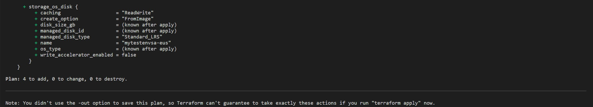
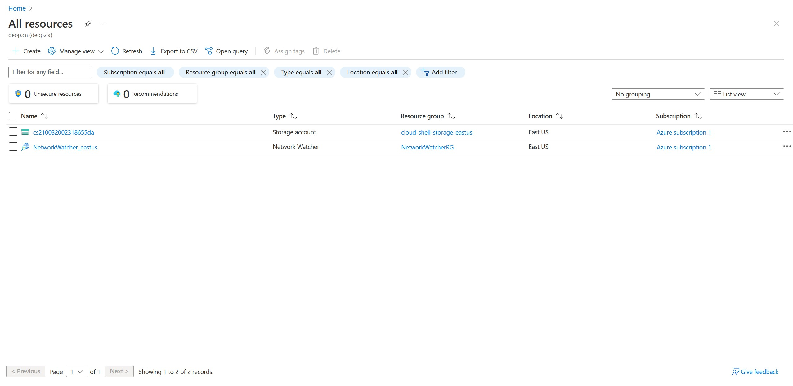
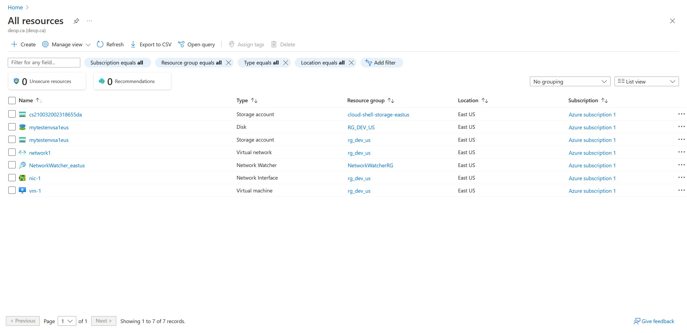
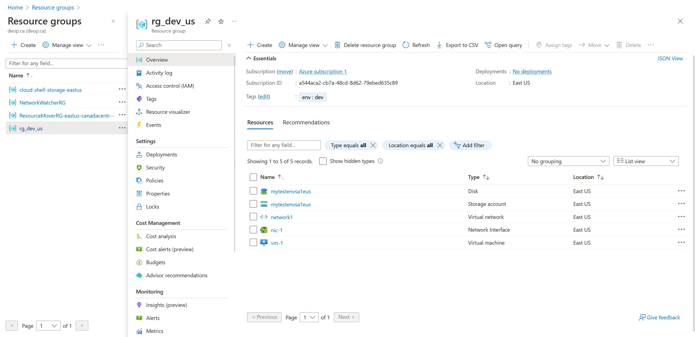

# Creating VM, storage account and a resource group with Terraform
Instead of creating a main.tf file, I created different tf files for each resource (it will provide better provision for later applications). Additionally, a variable.tf file is created for efficient coding.

### Step 1
Tf files are created for each resource:
- rg.tf (resource group)
- sa.tf (storage account)
- vm.tf (virtual machine)

Configurations are modified for every resource in these files.

### Step 2
Terraform initiated using terminal. 

### Step 3
All tf files are ready to implement terraform apply command. Ran command "terraform plan" to see if the provision will work. It return without errors.

Our terraform is ready to apply.

### Step 4
Ran the "terraform apply" command.

**Azure Portal before apply command**

**Azure Portal after apply command**

**Resource group view**

### Step 4
All resources are destroyed using "terraform destroy" command.

You can find related tf files in this repository.