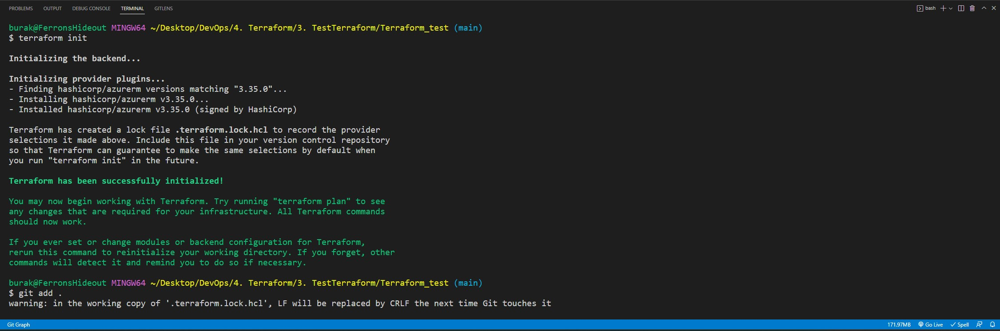

# Creating VM, storage account and a resource group with Terraform
Instead of creating a main.tf file, I created different tf files for each resource (it will provide better provision for later applications). Additionally,
a variable.tf file is created for efficient coding.

### Step 1
Tf files are created for each resource:
- rg.tf (resource group)
- sa.tf (storage account)
- vm.tf (virtual machine)

Configurations are modified for every resource in these files.

### Step 2
Terraform initiated using terminal. 

